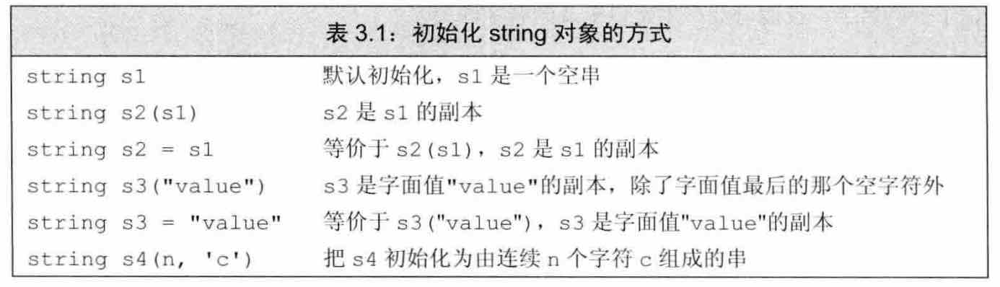
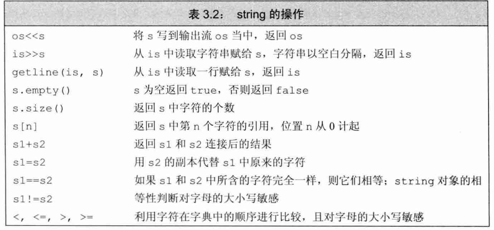
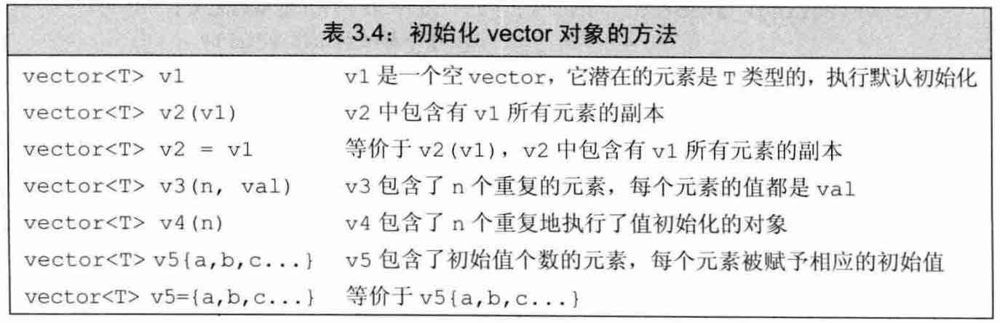
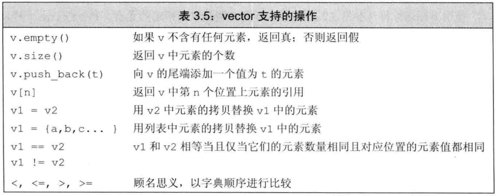
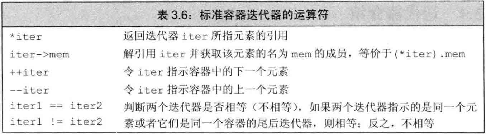

### CH3 字符串、向量和数组
## 
> 本章介绍两种最重要的标准库类型：string 和 vector。string 是一个可变长的字符序列，vector 则是一组同类型对象的容器！  
> 另外再介绍一种更复杂的内置类型：数组。
## 

#### 3.1 命名空间的 using 声明

1. `using namespace std;` 注意结尾处的分号！
2. `using std::cin; using std::cout;`
3. ❗️头文件不应包含 using 声明，因为它会被拷贝到所有引用它的文件中去，容易导致命名空间冲突！

## 
#### 3.2 标准库类型 `string`

1. 使用【要包含 命名空间std 和 头文件string】

	``` 
	#include <string>
	using namespace std;
	```

2. string类型的 定义和初始化  
	

3. string对象上的 操作  
	
	- 注意：s.size() 函数的返回值是：`string::size_type`  
	这是一个 无符号类型的值(**unsigned**)，并且能足够存下任何string对象的大小！
	- 在 C++ 11 中，我们可以使用 ` auto | decltype ` 来声明那些我们并不确定知道的变量类型！
	- <font color="red">切记：千万不要使用 `s.size() < n` 这类混用了 unsigned数 与 signed数 的表达式，因为你会得到意想不到的错误(Bugs)！</font>
	
	```
	int n = -10;
	str.size() < n; // ❌ 会得到错误的运行结果(true)，这是因为在这里你混用了 unsigned数 和 signed数。
	```
	
	- string对象的加法  
	注意：<font color = "red">当字符串和字面值混用在一条语句中使用时, 切记必须确保每个 加法运算符(+) 的两侧的运算对象 至少有一个是 string!</font>
	
	```
	string s1 = a2 + "def";               // ✅ OK
    //string s2 = "abc" + "def";          // ❌ 错误
    string s3 = s1 + ", " + "world";      // ✅ OK
    //string s4 = "abc" + ", " + s3;      // ❌ 错误
    记住：字面值是一种单独的字面值类型，而不属于任何其他类型，所以这里的 “abc” 并不是 string类型，而仅仅只是 字面值类型 而已！
	```
	
4. 对字符的处理  
	
	
	- 使用 `for (auto &c : str)` 语句实现逐字访问
	- 使用引用
	- 使用指针(数组下标)
	
	注意：<font color="red">使用数组下标访问时，请一定要注意：必须事先检查 确保下标在合理范围之内。</font>[下标必须 大于等于0  且 小于 size()]

## 
#### 3.3 标准库类型 `vector`

1. `vector` 是一个类模板，它是对象的集合。
	- 注意：vector 本身是模板，而并非是类型，由vector模板实例化才能得到具体的类型，例如：vector\<int\> 就是表示 int对象集合 的类型。
	
	
2. `vector`实例化类型的定义和初始化  
	
	
	- 注意：后两种被称作为“列表初始化”，这个列表只能被放在花括号里，而不能放在圆括号里！
	
	```
	vector<int> v1{1, 2, 3};		// ✅
	vector<int> v2 = {1, 2, 3}; 	// ✅
	vector<int> v3(1, 2, 3);		// ❌
	```
	
	- 如何判断 “是 列表初始值 还是 元素数量/元素初值”？**“花括号”vs."圆括号"**  
	初始化的真实含义：依赖于传递初始值时所用的是 “花括号” 还是 “圆括号”！
	
	```
	vector<int> v1(10);			// 圆括号，代表 v1 初始化有10个元素，初值默认均为0
	vector<int> v2{10};			// 花括号，代表 v2 初始化只有1个元素，该元素值为10
	
	vector<int> v3(10, 1);		// 圆括号，代表 v3 初始化有10个元素，初始值被设为 1
	vector<int> v4{10, 1};		// 花括号，代表 v4 初始化只有2个元素，它们分别为10和1
	
	// 但也请注意
	vector<string> v5{10, "hi"}; // 也是正确的，这里的10不是string类型的，无法用于初值
	vector<string> v6{10};		 // 也是正确的，编译器将这里的10用作了代表元素个数的含义
	```
	
3. 向 `vector` 中动态添加元素 **push_back()方法**
	- 注意：在 C++ 中，使用 vector 不要过多的依赖初始化，而<font color="blue">应该更多地使用 **push_back()方法** 进行动态添加</font>，这是因为：C++标准要求vector要能在运行时高效快速地添加元素，所以一开始创建空元素，然后再在运行时动态添加元素，这种方法往往反而比在一开始就初始化更高效！
	
	- 切记：`范围for循环 for(i:arr)` 循环体内不能改变其所遍历序列arr的大小！所以不要尝试在 `范围for循环`中向vector动态添加元素！
	
4. vector对象上的 其他操作  
	
	
	- 注意：`size()` 函数的返回值类似 string.size()，类型为 `vector<T>::size_type`，它是无符号(unsigned)类型的！切记：<font color="red">不可与 有符号类型的 signed 数字混用</font>！❌
	- 注意：vector对象的 `[] 下标运算符` 只可用于访问已存在的元素，而不能用于添加元素！
	<font color="red">不要试图用 下标运算符 添加元素</font>！❌

## 
#### 3.4 迭代器介绍

1. `string` 和 `vector` 除了支持使用下标运算符访问元素之外，还可使用另一种更通用的机制 `迭代器(iterator)` 来实现同样的目的！
	- 标准库中的容器，都可以使用迭代器访问，但只有少数几种容器同时支持下标运算符（比如：vector）！
	
2. 迭代器的使用 (类型不用写那么长，其实我们并不关心，所以可以直接用`auto`代替类型即可，方便且快捷)
	- 容器本身自带 **begin()** 和 **end()** 成员函数，用于获取迭代器！
	- 如果容器为空，则 **begin()** 和 **end()** 返回的就是同一个尾后迭代器(end iterator)。

3. 迭代器(iterator) 上的 操作  
	
	
4. 迭代器类型
	- 就像 string 和 vector 的 size_type 成员类型具体是什么，我们并不需要太过关心！  
	迭代器的精确类型我们往往也不需要太过于关心，<font color="blue">只需要用 `auto` 关键字代替即可！</font>
	
	- 实际上标准库为其定义了 iterator 和 const_iterator 来表示迭代器的类型，const_iterator和常量指针则有些类似！
	
5. `cbegin(), cend()` 与 `begin(), edn()` 之间的区别
	- 这两个函数也分别返回指示着 第一个元素 和 最后元素的下一个位置 的迭代器，但不同之处在于：它们返回的是 const_iterator 类型的迭代器。
	- 这里可以这样理解：`cbegin() = const_begin()` `cend() = const_end()`。
	
	<font color="red">谨记：但凡是使用了迭代器的循环体，都不要向迭代器所属的容器内添加元素，因为这会导致迭代器失效！</font>

> 他山之石：  
> 问：`二分查找` 中为什么用的是 `mid = beg + (end-beg)/2` 而非 `mid = (beg + end)/2` 呢？  
> 答：因为`(beg+end)`超出了容器的实际可用元素的范围，使用 `(beg+end)/2`会得到 缓冲区溢出错误！而使用前者则不会出现这种问题。  
> 联想：在基于数组的二分查找算法中我们也会遇到 `the statement m = (l+r)/2 will fail for large values of l and r.` 这种尴尬！  
> 解决方案也是：通过使用 `int mid = low + ((high - low) / 2);` 这种方式来找中间值。

## 
#### 3.5 数组

1. 数组是一种类似于 `vector` 的数据结构，但它的大小确定不变，不能随意向数组中增加元素。
	- 这样做的好处：固定数组大小，程序运行性能变得较好；
	- 这样做的坏处：固定数组大小，程序也相应损失了一些灵活性。
	
	<font color="red">如果你不清楚数组元素的确切个数，还是请你使用 vector。</font>
	
2. 数组的定义和初始化
	- 要想理解数组声明的含义：最好的办法是从数组的名字开始按照由内而外的顺序阅读！
	
	```
	比如：
		int (*Parray)[10] = &arr; 
		// Parray是一个指针，它指向 一个含有10个int型整数的数组。
		// arr[10] = {1, 2, 3, ...}
		// Parray = &arr;	(*Parray)[0] = arr[0] = 1
		
		int (&arrRef)[10] = arr;
		// arrRef是一个引用，它是 一个含有10个int型整数的数组 的别名！
		// arr[10] = {1, 2, 3, ...}
		// arrRef = arr;  (arrRef)[0] = arr[0] = 1
	```
	
3. 思考：如何让数组下标可变成负值？
	- 这就要求我们深刻理解 `数组下标` 的本质含义：
	
	```
	数组名本质上就是一个指针，只要这个指针所指向的是数组中的元素，那么都可以执行`下标运算`！
	int arr[5] = {1,2,3,4,5};
	int *p = arr+2;
	int a = arr[1];		// ✅ a = 2
	int b = p[1];		// ✅ b = 4
	int c = p[-2];		// ✅ c = 1，注意此时下标运算就是负值了！
	```
	
	- 注意：<font color="red">内置的下标运算符所用的 索引值 不是无符号类型</font>，这一点与 vector和string 都不同！
	
4. C 风格字符串 (c string)

> 注意：<font color="blue">尽量使用标准库类型而非数组</font>！  
> - 现代的 C++ 程序 应当尽量使用 `vector`容器和迭代器，避免使用内置数组和指针！应当尽量使用`string`，而避免使用C风格的基于数组的字符串！  
> - 这是因为使用指针和数组，极容易引发 `内存溢出` 或 `out of bounds` 错误！

## 
#### 3.6 多维数组

1. 多维数组的初始化
	
	```
	int arr[3][4] = {		// 三个元素，每个元素均是大小为4的数组
		{0, 1, 2, 3},
		{4, 5, 6, 7},
		{8, 9, 10, 11}
	};						// 用 花括号 将它们都括起来，就可以初始化了
	```
	
2. 要使用`范围for循环`语句处理多维数组，除了最内层的循环外，其他所有循环的控制变量都应该是引用类型！(如果你不想改变它的值，那就采用 const int& 常量引用)！

## 
END [Back](../part1-foundation.md)
## 