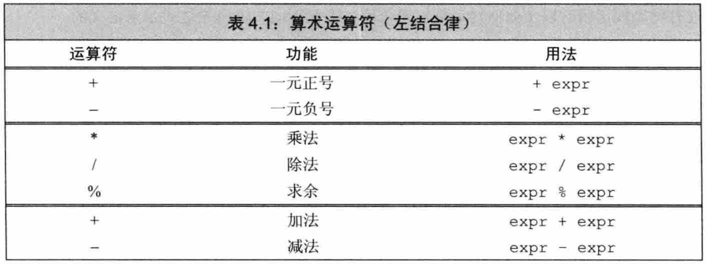
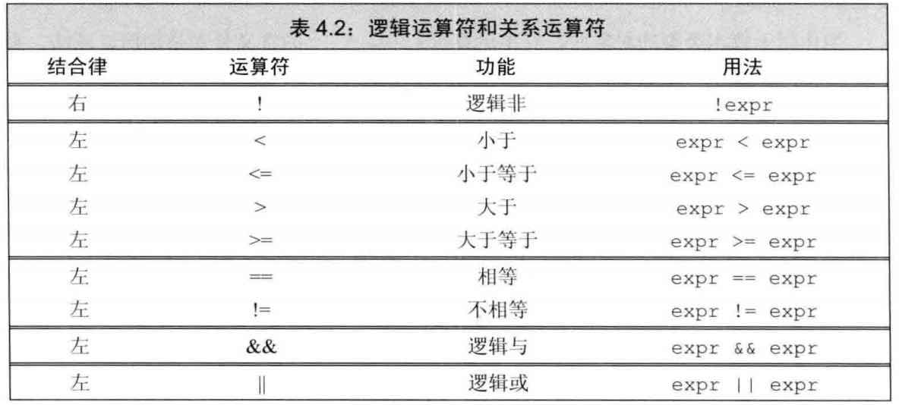
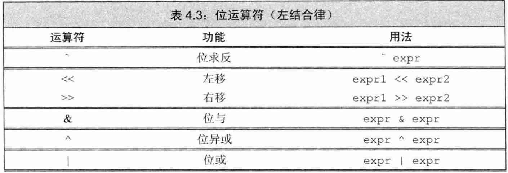
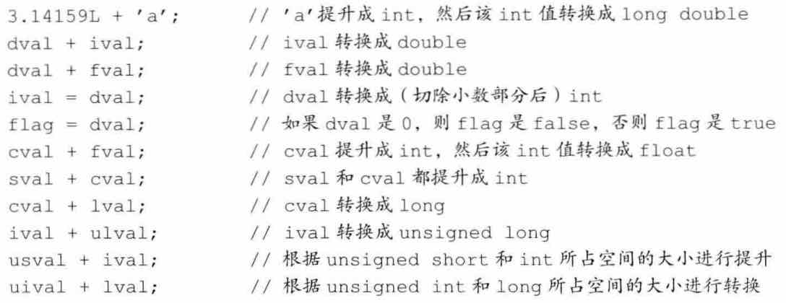

### CH4 表达式
## 
> 本章主要介绍 由语言本身定义，用于内置类型运算 的各种运算符，同时简单介绍几种标准库定义的运算符；  
> 第14章会介绍 `操作符重载`(overloaded operator) 用于操作用户自定义的类类型。
## 

#### 4.1 基础
1. 表达式的定义
	- 表达式 由一个或多个 运算对象(operand)组成，对表达式求值将得到一个结果。
	
2. <font color="red">`左值` vs. `右值`</font>
	- 左值（lvalue）是一个表达式，它表示一个可被标识的（变量或对象的）内存位置，并且允许使用&操作符来获取这块内存的地址。如果一个表达式不是左值，那它就被定义为右值。
	- 左值可以出现在赋值操作的左边或右边，但右值只能出现在右边。
	
	> ❗️判断一个表达式是否是左值，有一个简单的办法，就是看看能否取它的地址，能取地址的就是左值。
	
3. 关于 优先级，结合律 和 求值顺序
	- 优先级决定：那种运算先做；
	- 结合律决定：同种运算的不同部分 按什么顺序计算；
	- C++ 语言没有明确规定大多数二元运算符的求值顺序，这给编译器优化留下了余地！

## 
#### 4.2 算术 运算符


1. 算术运算符的 运算对象 和 求值结果 都是右值(不可取地址)！
2. 注意：算术运算符 易产生 未定义的结果！(如：除数为0，类型溢出等)
3. 注意：<font color="red">整除和取余 运算: 遵循 `m = n*(m/n) + m%n`</font>

	```
	21 = 6 * (3) + (3)
	-21 = 6 * (-3) + (-3)
	21 = -6 * (-3) + (3)   !!	❗️21/-6=-3, 21%-6=3
	-21 = -6 * (3) + (-3)  !!	❗️-21/-6=3, -21%-6=-3
	```

#### 4.3 逻辑与关系 运算符


1. 这两类运算符，运算对象和求值结果都是右值！
2. 逻辑与和或(`&&, ||`) 存在 **"短路求值"**(short-circuit evaluation)!
3. 注意：进行比较运算时除非比较的对象是布尔类型，否则不要使用布尔型字面值 true/false 作为运算对象，因为这会被直接转换为 1/0。

#### 4.4 赋值 运算符

1. 注意：<font color="blue">赋值运算符的左侧对象**必须是一个可修改的左值**！(可以取地址的变量表达式)</font>
2. 注意：*赋值运算符的优先级较低*！赋值运算符的优先级低于关系运算符的优先级，所以在条件语句中，赋值部分通常应该加上括号！
3. `复合赋值运算符 (+=, -=, etc.)` 只需求值一次，而普通运算符要实现相同的功能则需求值两次！

#### 4.5 递增递减 运算符

1. 注意：递增 和 递减 运算符两种形式：`前置版本 ++i` 和 `后置版本 i++` 之间的**区别**
	- **前置版本**：先将运算对象 加1/减1，然后再将改变后的对象 作为运算结果！
	- **后置版本**：先返回该求值对象的副本作为右值返回，再对运算对象执行 加1/减1 的运算！
	
	```
	int i = 0, j, k;
	j = ++i;	// i = 0->1, j = 1
	k = i++;	// k=i = 1, i = 1->2
	运算结果是：j = 1, k = 1, i = 2;
	```
	
	Tips: <font color="red">除非必须，否则不用递增递减运算符的后置版本。</font>
	
#### 4.6 成员访问 运算符

1. 点运算符 和 箭头运算符 都可用于访问成员：`ptr->item` 等价于 `(*ptr).item`。
	- 这里注意：解引用运算符的优先级要低于点运算符，所以执行解引用运算的子表达式两端必须必须加上括号！
	
	```
	(*p).size();	// ✅
	*p.size();		// ❌
	```

#### 4.7 条件 运算符

1. 条件运算符使用形式为：`cond ? expr1 : expr2;`
2. 条件运算符也可以嵌套使用，但是随着嵌套层数的增加，代码的可读性急剧下降，所以条件运算符的嵌套最好别超过 2-3 层。
3. 注意 条件运算符 的优先级非常低，`因此当一条长表达式中嵌套了条件运算自表达式时，通常需要在它的两端加上括号`！

#### 4.8 位 运算符


1. 位运算符 作用于整数类型运算对象，并把运算对象看成是`二进制位(bit)`的集合。
	- 关于符号位如何处理 位运算符 并未做出明确规定，所以`强烈建议：仅将位运算用于处理无符号类型`！
	
2. `左移运算符 (<<)` 在右侧插入 0，`右移运算符 (>>)` 在左侧插入什么视具体环境而定(可能是符号位，也可能是0)

#### 4.9 sizeof 运算符

1. sizeof() 运算符 对数组和指针 的不同处理方式
	
	```
	// sizeof() 运算符
	int x[10]; int *p = x;

	a: sizeof(x) = 40, b: sizeof(x[0]) = 4, a/b = 10 	// ✅
	a: sizeof(p) = 8, b: sizeof(*p) = 4, a/b = 2		// ❌

	// error 注意: 这里 p 不是数组了, 而是指针 int*, 占8个字节大小
	```
	> <font color="red">这也是为什么 C++ 写函数传递数组时, 为什么同时要求传递一个数组长度(length) 的原因</font>!

2. sizeof() 具有较高的优先级（与解引用运算符*的优先级一样）

	```
	int a = 1, b = 2;
    int res = sizeof a + b;
    cout << "sizeof a + b = " << res << endl;		// 输出 6
    res = sizeof (a + b);
    cout << "sizeof (a + b) = " << res << endl;		// 输出 4
	```

#### 4.10 逗号 运算符
- 就是表示并列关系，没有什么特殊含义，忽略之。

## 
#### 4.11 类型转换

1. 算术转换 (arithmetic conversion)
	- 整型提升
	- 无符号类型的隐式转换 (signed->unsigned)
	
	

2. 其他隐式转换
	- 数组转换为指针：大多数用到数组的表达式中，数组都会自动转换成 指向数组首元素的指针。
		* 除了：当作为 `decltype, 取地址运算符&，sizeof` 运算符的运算对象时，不会自动转换！
		* 注意：<font color="red">当作为 `函数参数` 时，就会自动转换成指针，所以必须要再加入一个代表数组长度 len 的函数参数。</font>
		
	- 指针的转换
		* 指针转换为 布尔类型 
		
		```
		char *p;
		if (p) {...}
		```
		* 转换为 常量指针 const int * 
		* 用户自定义的 转换 (类类型的转换)
	
3. 显式转换
	- 建议：避免强制类型转换，因为它干扰了正常的类型检查，强烈建议程序员避免使用强制类型转换。
	
#### 4.12 运算符优先级表

- 优先级最高：`::` 作用域运算符
- 优先级最低：符合赋值运算符（`*=, /= ,+=, -=, etc.`）与 逗号运算符 `,`。

## 
END [Back](../part1-foundation.md)
## 