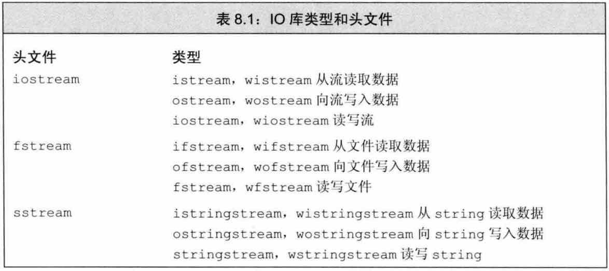
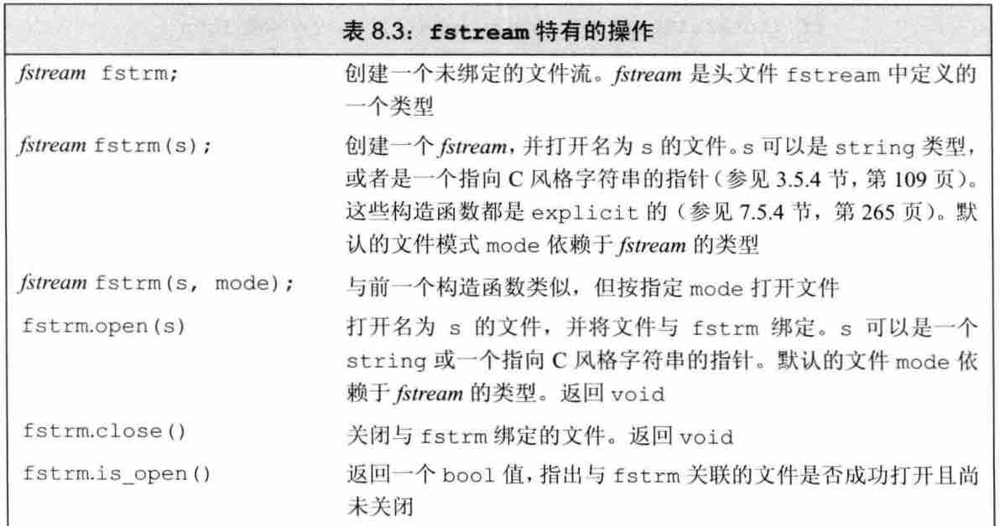
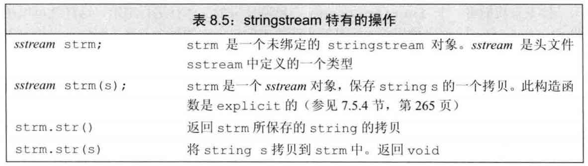

### CH8 IO 库
> 本章主要介绍：C++ IO相关的三个库文件：控制台IO，文件IO 和 内存string的IO。  
> `fstream` 和 `sstream` 都是继承自`iostream`，其中输入类继承自`istream`，输出类继承自`ostream`。

#### 8.1 IO 类 `iostream`
1. 标准库中所定义的 三个IO相关头文件

	* `iostream` 负责在 **控制流** 中读写数据；
	* `fstream` 负责在 **文件** 中读写数据；
	* `sstream` 负责在 `string` 中读写数据。
	* 另注意：**w**istream.h 代表的是宽字符(wide)读取。

2. IO对象 无拷贝和赋值 操作，所以作为参数传递时，只能采用`引用传参`的方式。
	- 读写流本身具有 条件状态，所以我们可以把它当成一个条件来使用。
	
3. 输出流 存在 缓冲区，用于保存当前读写的数据，所以输出一般都需要管理缓冲区
	- 注意：<font color="blue">正常 `cout << "hello";` 是不会直接输出数据的，它只是被放进了缓冲区，要想将缓冲区内的数据显示出来，需要 `刷新缓冲区`</font>：
		* ✅ 程序正常结束，会自动刷新缓冲区；
		* 缓冲区满，会刷新缓冲区；
		* ✅ 使用操纵符 `endl, flush, ends` 可以显式的刷新缓冲区；
		* ✅ 当 一个输出流a 被关联到 另一个流b 时，b的读写操作会导致a的缓冲区被刷新；
		* 最后，可以用 操纵符 unitbuf 来设置输出流 内部状态为缓冲区一有数据就立马刷新缓冲区！

## 
#### 8.2 文件输入输出 `fstream`
1. `fstream` 所特有的操作

	* `open()` 操作打开一个文件，并将文件流对象与文件关联起来；
	* 注意当我们用一个文件创建一个 fstream 对象时，open()函数会自动被调用；相应地当一个 fstream 对象被销毁时，close()函数也会自动被调用！
	
2. 关于 `文件模式`
	- 每次打开文件时，都要设置文件打开模式，可能是显式设置，也可能是隐式设置，当程序未指定模式时，就是用默认模式打开。常用模式有：
		* `i` 读模式	in
		* `o` 写模式	out
		* `a` 追加模式 app
		* `t` 截断模式 trunc (或者说是会替换原文件中的数据)
		* `b` 二进制模式 binary

## 
#### 8.3 string 流 `sstream`
> 允许从内存中存取数据（内存IO），即：从 string 读取数据，向 string 写入数据。

1. `sstream` 所特有的操作

	* <font color="red">注意：也就是说我们利用`sstream`可以把一个 string 类型的字符串当做是标准输入输出数据来使用</font>！
	
2. 使用 `istringstream`

	```
	string name, vector<int> phone; 
	while (getline(cin, line_str)) {	// 从标准输入输出中读取 一行
		istringstream s_cin(line_str);		// 用 string 来初始化一个 sstream 对象
		s_cin >> name;
		int temp;
		while (s_cin >> temp) {
			phone.push_back(temp);
		}
	}
	```
3. 使用 `ostringstream`
	- 可用于 逐步构造输出，然后最后再一起打印出来。

## 
END [back](../../part2-stdlib.md)
## 
