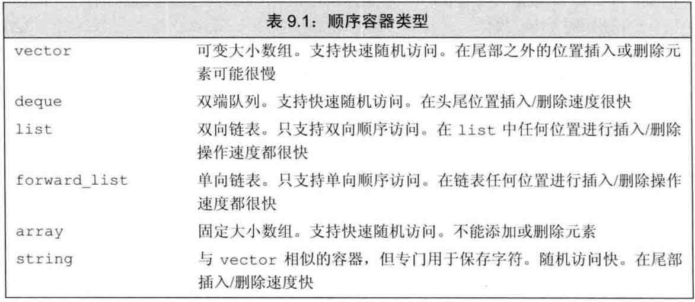
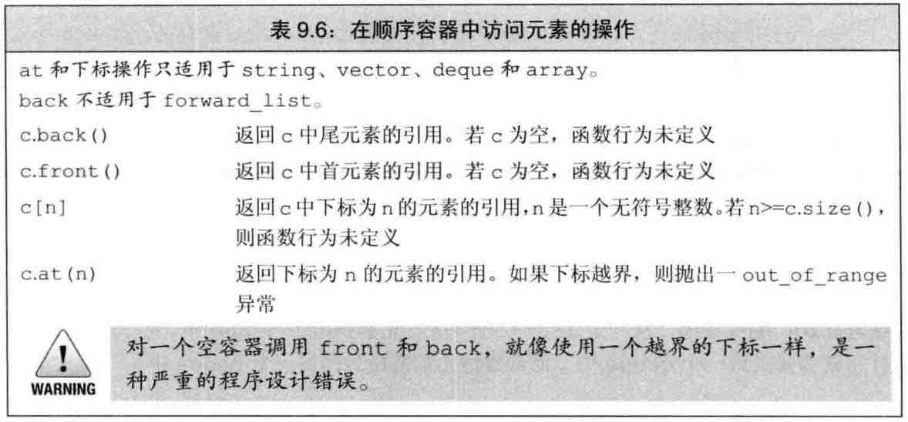
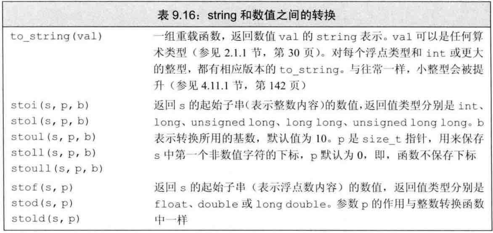

### CH9 顺序容器 (sequence container)
> · 本章是 [第三章 字符串，向量和数组](../../CH3_String_Vector_Arrays/ch3_string_vector_arrays.md) 内容的扩展。  
> · 容器(container) 就是 一些特定类型对象的集合。

#### 9.1 顺序容器概述
1. 顺序容器有哪些？

	- 这些容器都在性能方面做出了折中考虑：是要 更低的`添加删除元素代价` 还是 要更低的`访问非顺序元素的代价`；
	- 新标准库对数据结构的性能已经做了很好的优化，所以<font color="blue">现代C++程序应该使用标准库容器</font>，而不是执着于使用那些自定义的更为原始的数据结构。
	- 通常，**使用`vector`顺序容器就是一个很好的选择**，除非你有更好的理由去选择其他容器！
	- 注意，`array`容器是新引入的，它的构造比较特别：它必须同时指定容器的类型和大小，且大小不允许再变，比如：`array<int, 10> arr; ✅` `array<int> arr; ❌`
	
2. 选择顺序容器 主要也是考虑 “你是要更好的随机访问元素” 还是 “更需要在容器中插入更多的元素”！

## 
#### 9.2 容器库概览
1. 本节主要介绍 对所有容器都适用 的操作，本章其他节介绍 仅对顺序容器适用的操作，[11章 关联容器](./CH11_assContainer/ch11_asscontainer.md) 将介绍 关联容器所特有的操作。

	```
	Container c(c1);
	Container c(iter begin, end);
	Container c{a, b, c ...};		// 列表初始化
	```

2. 迭代器范围 精确定义（左闭合区间）`[begin, end)`。这样定义的好处在于：一旦我们知道了 `begin = end`，那么我们也就确信了该容器为空了。

3. `begin, end` vs. `rbegin, rend` vs. `cbegin, cend`
	
	- `begin, end`
	- `rbegin, rend` = **reverse** begin, **reverse** end 反向迭代器
	- `cbegin, cend` = **const** begin, **const** end 常量迭代器
	
4. 只有顺序容器才支持的接受大小的构造函数
	
	```
	Container c(n);			// 构造一个包含 n 个元素的顺序容器
	Container c(n, t);		// 构造一个包含 n 个元素且初值均为 t 的容器
	||
	vector<int> vec1(10, -1);	// 10个元素的容器(初始化均为-1)
	vector<int> vec2(10); 		// 10个元素的容器(初始化均为默认值0)
	vector<int> vec3{10, -1};	// 2 个元素的容器，使用花括号的代表 列表初始化。
	```
	❗️注意：<font color="red">只有顺序容器的构造函数才支持接受大小参数，关联容器并不支持</font>！
	
5. 使用`关系运算符`来比较两个容器，实际上是在进行元素的逐对比较，这些比较的具体工作方式 其实与比较两个`string`的机制相同。

## 
#### 9.3 顺序容器操作 (只针对于顺序容器)
1. 添加元素
	- 三种方法：
		* `push_back(t)`, `push_front(t)`
		* `insert(pos_iter, t)`, `insert(pos_iter, n, t)`
		* `emplace_back(*args*)`, `emplace_front(*args*)`, `emplace(pos_iter, *args*)`

	> emplace 函数在容器内部利用 构造函数的`*args*` 直接构造容器内的元素，然后将其存入容器；  
	> 对比其他两种方法，都是直接提供 容器内元素的对象，然后将该对象的拷贝存入容器。
	
2. 访问元素


	- ❗️注意：<font color="red">这几个在容器中访问元素的成员函数 的返回值都是`引用`类型</font> (也就是说是左值，可直接对其赋值,改变它的值等)

	```
	if (!(container) c.empty()) {
		c.front = 42;			// ✅ c 的首元素被赋予新值 42
		auto &v = c.back();		
		v = 1024;				// ✅ 这里 通过引用的方式 改变c的末值为 1024
		auto v2 = c.back();
		v2 = 0;					// 这里 未改变容器c中的末值，因为 v2是非引用类型
	}
	```
	
	- ❗️另外：`使用下标访问` vs. `使用at(n)访问`：<font color="blue">下标访问不会对下标是否越界进行检查，而`at(n)`则**提供带下标检查的安全的随机访问**。</font>
	
3. 删除元素
	- 三种方法：
		* `pop_back()`, `pop_front()`
		* `erase(pos_iter)`, `erase(begin, end)`
		* `clear()` 清空元素
	
4. forward_list 的特殊操作

5. 改变容器大小 
	- `resize(int new_size)`
	- `resize(int new_size, int t)` 调整c的大小为n个元素，任何新添加的元素初始值均为 t。

6. 由容器操作所引发的迭代器失效
	- ❗️注意：<font color="red">严禁使用失效的迭代器、指针或引用，因为一旦使用会导致严重的Runtime Error (运行时错误)</font>

#### 9.4 vector 对象 是如何增长的
1. 关于两个函数：`capacity()` 与 `reserve(n)`
	- `capacity()` 函数返回的是：在不重新分配内存空间的情况下，该容器的容量(它到底可以保存多少元素)；
	- `reserve(n)` 实际上是对容器提出了一个内存分配的要求：要求至少能容纳 n 个元素的内存空间。**它不改变容器中元素的数量，但它却影响 vector 预先分配的内存空间大小**。
	
2. 区分两个函数：`resize(n)` 与 `reserve(n)`
	- `reserve(n)` 改变的是 容器的**容量大小**
	- `resize(n)` 改变的则是 容器中的**元素个数**，而不是容器的容量。
	
3. 区分两个函数：`size()` 与 `capacity()`
	- `size()` 返回的是：容器内已经保存的元素的数目(元素个数)；
	- `capacity()` 返回的是：该容器本身在不分配新内存的前提下，它最多能保存多少元素(容量大小)！

4. `vector 对象` 增长的原则
	- 只要一个操作 它的需求没有超出vector的容量(capacity) [size() <= capacity]，那么vector就不会重新分配内存空间；
	- 一旦它超出了那个capacity [size() = capacity + 1 ], 那么它的<font color="blue">增长策略就是：新分配一块能容纳当前容器vec1的容量 **两倍** 的空间出来vec2，然后将当前vec1内的所有元素全部拷贝到vec2中，然后再将原来的容器vec1所占的空间释放掉，最后再将vec1指向vec2</font>。

#### 9.5 额外的 string 操作
1. 构造 `string` 的其他方法
2. 改变 `string` 的其他方法
3. `string` 的搜索操作 `find()`
4. `compare 函数`
5. `string` 的数值转换


#### 9.6 容器适配器
- 三种 `stack`, `queue`, `priority_queue` 适配器，它们接受一个 类型/函数/迭代器，使其行为像另一种类型，函数或迭代器。
	* 比如：`stack`，生成一种新类型，只接受 FILO;
	* 比如：`queue`，生成一个类型，只接受 FIFO；
	* 比如：`priority_queue`，生成一种队列，它新插入的元素不放在队尾，而是根据特定优先级排列。

## 
END [back](../../part2-stdlib.md)
## 
